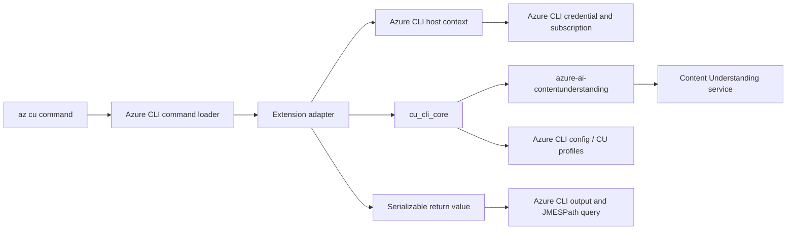

# Azure CLI extension implementation plan

## Status

- **Proposal:** Publish an Azure CLI extension named `content-understanding` that exposes the top-level command group `az cu`.
- **Source repository:** Build and maintain the extension in this public `Azure/content-understanding-toolkit` GitHub repository, alongside `cu-cli-core` and the standalone CU CLI.
- **Recommended delivery:** Add a native Azure CLI frontend over the existing framework-neutral `cu_cli_core` implementation. Do not embed or invoke the standalone Click CLI.
- **Rollout:** Preview the Azure CLI extension alongside the existing standalone `cu` command. Do not remove or redirect the standalone CLI until adoption, compatibility, and support requirements are understood.
- **Scope of this document:** Architecture, command rollout, engineering work, testing, publication, risks, and acceptance criteria. It does not authorize use of the `cu` command name; that agreement is a Phase 0 prerequisite.

## Executive summary

The current CU CLI is already close to the architecture needed for an Azure CLI extension. Its command metadata, request contracts, serialization, profile storage, and most Content Understanding operations are in `cu-cli-core`, while Click/Rich parsing and presentation are in the standalone package. The extension should be a third package in this repository. It should consume the same `cu-cli-core` source through a maintainer-approved public dependency or build-generated bundle and replace the standalone frontend with Azure CLI-native command registration, authentication, errors, output, help, and tests.

The intended user experience is:

```text
az extension add --name content-understanding
az cu analyzer list --endpoint https://<resource-name>.services.ai.azure.com/
az cu analyze --file invoice.pdf --analyzer-name prebuilt-invoice
```

The extension distribution name and command group do not have to match. Existing extensions demonstrate this pattern; therefore `content-understanding` can register commands below `az cu`. The short top-level name is still global Azure CLI UX, so the team should obtain agreement from Azure CLI owners before implementation. Source PRs will be reviewed in this repository. A separate PR to the Azure CLI extension index is the publication gate, but waiting until that PR to discuss the name creates avoidable rework.

The recommended preview sequence is:

1. Agree on naming, ownership, supported clouds, and the initial command surface.
2. Prove the existing shared core boundary with a native `az cu analyzer list` vertical slice; change core only where that slice demonstrates a missing host-neutral contract.
3. Build out the small native extension adapter and ship analyzer management plus single-input analysis first.
4. Add batch analysis, defaults, profiles, validation, testing, and analyzer copy in later increments.
5. Defer interactive provisioning and omit self-upgrade from the extension.

## Goals and non-goals

### Goals

- Provide an official Azure CLI experience under `az cu`.
- Reuse one implementation of CU operations across standalone and Azure CLI frontends.
- Use the identity, active subscription, cloud, output, query, logging, telemetry, confirmation, and error conventions of the host Azure CLI.
- Preserve scriptable JSON output and standard Azure CLI `--output` and `--query` behavior.
- Keep the first preview small enough to review, test, and support safely.
- Maintain the standalone `cu` frontend during the preview period.

### Non-goals

- Wrapping the existing `cu` executable in a subprocess.
- Registering Click commands inside Azure CLI.
- Reproducing Rich tables, colors, progress rendering, or standalone self-update behavior.
- Shipping every standalone command in the first extension release.
- Moving infrastructure provisioning into the extension before its noninteractive contract and ownership are agreed.
- Changing the Content Understanding REST API or SDK surface.

## Phase 0: decisions and approval

Complete this phase before creating the extension package.

### 0.1 Command and extension naming

Open an early design discussion with Azure CLI maintainers covering:

- Extension distribution name: `content-understanding`.
- Root command group: `az cu`.
- Whether `cu` is sufficiently clear, discoverable, and durable as a global command name.
- Whether the service should instead use a longer group such as `az content-understanding`.
- Whether automatic dynamic installation should be enabled for the group.

There is no separate public name-reservation mechanism assumed by this plan. Acceptance ultimately occurs through review and publication of the extension, but explicit agreement on the global command tree should be recorded before implementation.

### 0.2 Ownership and support

Record:

- At least two service-team maintainers and the Azure CLI reviewer/owner path.
- Public issue routing and support expectations.
- Release owner, servicing cadence, and response expectations for broken releases.
- Telemetry ownership and the data-classification review required for any new fields.
- The minimum Azure CLI core version and Python versions to support.
- That `Azure/content-understanding-toolkit` is the source, issue, and release repository, while `Azure/azure-cli-extensions` carries only the official index metadata needed for installation by name.

### 0.3 Product decisions

Resolve these questions:

1. Is the preview installed from a GitHub release wheel first, or published immediately in the public Azure CLI extension index?
2. Which Azure clouds are supported? If only AzureCloud is supported, fail early with an actionable error rather than constructing public-cloud URLs in sovereign clouds.
3. Is API-key authentication required in the Azure CLI extension, or should the first preview support Microsoft Entra authentication only?
4. Should standalone and extension profiles intentionally share the `[cu]` sections in the Azure CLI configuration file?
5. Is `az cu provision` part of the long-term Azure CLI surface, or should provisioning use existing `az cognitiveservices`, `az deployment`, and Foundry commands?
6. Which CU API/SDK version is the preview pinned to?

**Exit criterion:** A short decision record approved by CU and Azure CLI owners, with the root command, extension name, initial scope, minimum CLI version, supported clouds, and maintainers fixed.

## Current architecture assessment

### Reusable components

`cu_cli_core` is intentionally frontend-neutral and is the correct reuse boundary. It provides:

- `CommandSpec` and `ArgumentSpec` metadata for canonical commands and arguments.
- Surface classifications that distinguish common options, standalone shortcuts, Azure-host globals, and presentation-only options.
- Request construction through `build_request()`.
- Analyzer, analysis, validation, schema, defaults, profile, and environment operations.
- Dataclass request/result contracts and plain-value serialization.
- Input/output planning and collision handling.
- Profile persistence in the Azure CLI configuration file under the `[cu]` namespace.
- Shared API-version metadata and service option definitions.

This separation should be preserved. The core must not import `azure.cli.*`, Click, Rich, Knack, or an Azure CLI extension package.

### Core readiness finding

The source audit found **no mandatory core refactoring for the MVP**:

- `build_content_understanding_client()` already accepts a caller-provided credential.
- Analyzer CRUD, analysis, and defaults operations already accept an injected client rather than constructing frontend identity state.
- `CommandSpec`, request contracts, `CuCoreError`, and `to_plain_value()` already provide neutral argument, error, and output boundaries.
- The core import-isolation test verifies that command metadata and contracts load without Click, Rich, Knack, Azure SDK, standalone, or extension modules.
- Core operations do not own Azure CLI command registration, output rendering, confirmation, or process exit behavior.

Static review is not the final integration proof. The first implementation task is a thin `az cu analyzer list` vertical slice. Core remains unchanged if the slice only needs to acquire host state, call existing core APIs, translate errors, and return a plain value. A core change is justified only if the slice reveals duplicated CU domain logic, a host dependency that cannot be injected, an unserializable result, or insufficient structured error information.

### Components that must not be reused as the extension frontend

The standalone package directly owns behaviors that are incompatible with a native Azure CLI extension:

- Click and rich-click decorators, positional shortcuts, help rendering, and command ordering.
- Rich consoles, tables, colors, progress messages, and direct writes to standard output.
- `DefaultAzureCredential` creation inside command execution.
- Shelling out to `az` to obtain the current subscription.
- Interactive provisioning prompts and `azd` subprocesses.
- Standalone update checks and `cu upgrade`/Windows self-upgrade.
- Click-specific exceptions and exit handling.

These are useful references for behavior, not code to call from the extension.

## Azure CLI convention gap analysis

The shared core gives us a strong starting point, but the standalone frontend is not an Azure CLI extension. A source audit found no mandatory core changes for the MVP: core already avoids Click, Rich, Knack, Azure CLI, credential construction, direct output, and process exits; accepts an injected credential when constructing the CU SDK client; exposes frontend-neutral command/request contracts and structured errors; and converts SDK/dataclass results through `to_plain_value()`. The main work is therefore replacing frontend and host integration behavior, not rewriting Content Understanding operations or introducing a speculative host abstraction.

| Area | Current CU CLI | Azure CLI convention | Required change | Priority |
|---|---|---|---|---:|
| Command registration | Commands and groups use Click/rich-click decorators and are assembled by `cu_cli.cli`. | Register commands through `AzCommandsLoader`, `CliCommandType`, `commands.py`, and `_params.py`. | Create a separate `azext_content_understanding` frontend. Do not import or invoke `cu_cli.cli`. Bind approved `CommandSpec` entries to thin custom commands. | P0 |
| Root command and naming | Executables are `cu` and `cu-cli`; several values have positional shortcuts. | Commands are under the global `az` tree; options normally use established Azure CLI names and global options must not be duplicated. | Register `az cu`; obtain command-name approval; review every option and alias. Prefer explicit options such as `--name`/`--analyzer-name`; omit standalone-only positional shortcuts. | P0 |
| Authentication | Client creation uses `DefaultAzureCredential`, which may select environment, workload, managed identity, developer CLI, or Azure CLI credentials. | Extension commands should use the identity and tenant associated with the current `az login` context. | Add an extension credential factory backed by `Profile(cli_ctx=cmd.cli_ctx)` and inject that credential into core/client construction. Keep standalone `DefaultAzureCredential` behavior only in the standalone adapter. | P0 |
| Subscription context | Analyzer-copy resource discovery can run `az account show` in a subprocess. | Read the active subscription directly from `cmd.cli_ctx`/Azure CLI profile; honor global `--subscription`. | Add `subscription_id` to the host execution context and remove child-`az` calls from all extension paths. Pass explicit source/destination subscriptions only where copy needs them. | P0 |
| Cloud endpoints | Standalone behavior is primarily public-cloud endpoint oriented. | Extensions must respect Azure CLI cloud metadata or clearly reject unsupported clouds. | Inject cloud/ARM authority metadata from `cmd.cli_ctx.cloud`. Normalize CU endpoints without hard-coding AzureCloud. Add an explicit unsupported-cloud check until other clouds are tested. | P0 |
| Output | Commands render Rich tables/status, write JSON or Markdown directly to stdout, and use CU-specific output switches. | Commands return serializable objects; Azure CLI applies `--output`, `--query`, color, and table transforms. | Make extension handlers return `to_plain_value()` results. Move status/progress to logging. Add table transforms only for selected list/show commands. Keep explicit file-writing options only for artifacts. | P0 |
| Errors | `CuCliError` extends `click.ClickException`; the decorator prints Rich errors and sometimes calls `sys.exit()`. | Raise Azure CLI/Knack argument, validation, not-found, conflict, authentication, and service exceptions. The host controls formatting and exit codes. | Build `_errors.py` to translate `CuCoreError` and Azure SDK exceptions. Preserve nested service detail and hints, redact secrets, and remove direct exit/console behavior from extension paths. | P0 |
| Help | Help text and examples contain Rich markup and standalone command names. | Help is registered through `_help.py`, with Azure CLI parameter help and examples. | Write native group/command help, replace every `cu ...` reference with `az cu ...`, remove Rich markup, and add `--output`/`--query` examples. | P0 |
| Confirmation and prompts | Commands use `click.confirm`/`click.prompt`; provisioning is an interactive wizard. | Destructive commands use Azure CLI confirmation conventions and automation must be noninteractive when fully specified. | Use `user_confirmation` and `--yes` for delete/overwrite. Convert any required choices to options. Defer `provision` and `infra-models` instead of porting their interactive UX. | P0 |
| Long-running operations and progress | The standalone frontend prints progress and summaries; core analysis already accepts an optional result callback. | Azure CLI owns progress presentation; command results remain machine-readable. `--no-wait`/`wait` should be used only when a coherent async contract exists. | Reuse the existing core callback where sufficient and keep Azure CLI logging in the adapter. Add a new neutral event contract only if later batch/LRO scenarios prove the callback insufficient. Start MVP with synchronous completion. | P1 |
| Configuration | Core directly parses and atomically updates `[cu]` sections in the Azure CLI config file. Profiles can contain an API key. | Extensions should coexist safely with Azure CLI config and never expose secrets. | Confirm use of `[cu]` with CLI owners, adapt reads/writes to host config APIs where practical, preserve unknown sections, test concurrent updates, and never return stored keys. Keep current format initially to preserve standalone compatibility. | P0 |
| API keys | `--api-key` is accepted and warnings are printed by the standalone client factory. | Secrets must not leak through history, process lists, debug logs, output, telemetry, or recordings. | Prefer Entra-only MVP. If key auth is required, isolate the option, mark it secret in command metadata, redact it everywhere, and move warnings to Azure CLI logging. | P0 |
| Telemetry and logging | Standalone has its own user-agent, timing, update check, and Rich diagnostics. | Use Azure CLI logging/telemetry and extension version metadata; never collect customer content or secrets. | Add extension user-agent information without replacing host telemetry. Remove standalone update checks and duplicate timing telemetry. Define and review a minimal non-sensitive event schema. | P1 |
| Upgrade | `cu upgrade` invokes pip and includes Windows self-upgrade logic. | Extensions are updated by `az extension update`. | Do not register `az cu upgrade`; do not package update-check or self-upgrade modules. Document `az extension update --name content-understanding`. | P0 |
| Provisioning | `cu provision` generates assets, prompts users, and invokes `azd`/other processes. | Azure CLI provisioning should use native management clients/commands, standard resource arguments, and noninteractive automation. | Keep provisioning standalone-only for MVP. Run a separate design review before implementing native resource creation; do not wrap `azd` or recursively invoke `az`. | P1 |
| Packaging | Standalone pulls Click, Rich, identity, management clients, provisioning assets, and core. `cu-cli-core` is not currently published on public PyPI. | Extension wheels should be small, compatible with Azure CLI's Python environment, and publicly installable. Dependency installation behavior and compatibility must be accepted by Azure CLI maintainers. | Add a dedicated extension package with only required runtime code. Decide with maintainers whether it uses a bounded public `cu-cli-core` dependency or a build-generated bundled core snapshot. Never depend on the standalone package or maintain a hand-copied core tree. Test the final wheel against minimum/current Azure CLI. | P0 |
| Release | Existing workflow builds core and standalone distributions for PyPI. | An externally maintained extension needs a public immutable wheel and an official Azure CLI index entry. | Build all artifacts from one commit. Publish core first only if the dependency model is approved; publish the extension wheel as a versioned toolkit GitHub Release asset, verify its public URL and SHA-256, then submit/update the index entry. | P0 |
| Testing | Current tests focus on core, standalone Click behavior, and standalone playback. | Extension tests must cover command loading, host context, output/query behavior, extension packaging, and Azure CLI test SDK scenarios. | Add command-loader/unit tests, fake host-context tests, clean-wheel installation, `az cu -h`, output/query tests, redaction tests, and recorded service scenarios. Continue running all standalone tests. | P0 |
| Dynamic installation | Not applicable to the standalone executable. | Azure CLI can map an unknown command group to an indexed extension. | After index publication, ensure the command tree maps `cu` to `content-understanding`; test with dynamic install enabled and disabled. | P1 |

### What can remain unchanged

The following core capabilities should be reused as-is unless the vertical slice or later command tests expose a concrete gap:

- `CommandSpec`, `ArgumentSpec`, surface classifications, and `build_request()`.
- Request dataclasses and validation rules.
- Analyzer list/show/create/delete operations.
- Analysis, input planning, output collision handling, and schema validation.
- Defaults and profile domain logic.
- `to_plain_value()` serialization.
- Existing SDK polling behavior for the synchronous MVP.

### Concrete code changes

#### 1. Shared core readiness validation

Do not preemptively add a broad `HostContext` or refactor core before building the extension. The audit found the MVP operations already expose the necessary seams. Validate and preserve them:

1. Keep client construction credential-injected and operations client-injected.
2. Keep extension-used operations free of Click, Rich, Knack, `azure.cli`, standalone imports, direct terminal output, process exits, and child-`az` execution.
3. Verify every MVP result passes through `to_plain_value()` and every expected failure is represented by the existing structured core error hierarchy.
4. Add adapter contract tests that execute core operations with fake clients and host values.
5. Change core only when a command spike demonstrates duplicated domain logic, an uninjectable host dependency, an unserializable result, or insufficient structured error information.
6. Treat subscription/cloud injection as a later analyzer-copy requirement unless an MVP data-plane command proves otherwise.

#### 2. Standalone frontend

Keep `cu-cli/packages/standalone` working while the extension adds its own host adapter:

1. Preserve standalone `DefaultAzureCredential` and profile behavior in the standalone adapter; do not introduce a shared host context solely for symmetry.
2. Keep Rich/Click rendering, prompts, positional shortcuts, and update behavior local to this package.
3. Stop reusable modules from reading Click context or printing directly; presentation remains in command handlers.
4. Run standalone regression tests for every extension change that also changes shared core contracts.

#### 3. Azure CLI extension frontend

Create `cu-cli/packages/azure-cli-extension`:

1. Add `AzCommandsLoader`, command registration, parameters, help, validators, formatters, and custom handlers.
2. Build credentials and subscription/cloud context from `cmd.cli_ctx`.
3. Translate parsed arguments into shared request contracts and invoke shared operations.
4. Return plain serializable values and register optional table transforms.
5. Translate core/SDK errors into Azure CLI exceptions.
6. Implement Azure CLI-native confirmation and logging.
7. Do not register `upgrade`, `provision`, or `infra-models` for MVP.

#### 4. Build, CI, and release

1. Extend `cu-cli/scripts/ci.sh` to install, lint, type-check, and test the extension.
2. Extend the GitHub Actions matrix cache and path handling for the third package.
3. Extend the release workflow to build and validate all three wheels, then publish according to the approved dependency-or-bundle model.
4. Add a clean environment test that installs the built core and extension wheels and executes `az cu -h`.
5. Add an Azure CLI index validation job or release checklist using the external wheel URL and SHA-256.

### Recommended implementation order

1. **Extension skeleton:** make `az cu -h` load with one offline command.
2. **Vertical slice:** implement `az cu analyzer list` using Azure CLI host authentication, the existing injected core client factory, the existing analyzer operation, `to_plain_value()`, and core-error translation.
3. **Core readiness gate:** retain core unchanged if the adapter contains only host mapping; make a focused core change only when the slice satisfies one of the documented change criteria.
4. **Output and errors:** establish the scripting contract before expanding the surface; then add analyzer show.
5. **Create/delete/defaults:** add mutation confirmation and structured results.
6. **Single-input analyze:** add LRO completion and artifact-output semantics.
7. **Packaging and publication:** clean-wheel install, GitHub release, and extension index.
8. **Later parity:** validation/schema, batch, profiles, copy, diagnostics, then a separate provisioning decision.

## Proposed architecture



### Extension package layout

Create the extension as a third package in this repository with this shape:

```text
cu-cli/
├── packages/
│   ├── core/
│   ├── standalone/
│   └── azure-cli-extension/
│       ├── HISTORY.rst
│       ├── README.md
│       ├── setup.cfg
│       ├── setup.py
│       ├── azext_content_understanding/
│       │   ├── __init__.py
│       │   ├── azext_metadata.json
│       │   ├── commands.py
│       │   ├── _params.py
│       │   ├── _help.py
│       │   ├── custom.py
│       │   ├── _client_factory.py
│       │   ├── _auth.py
│       │   ├── _errors.py
│       │   ├── _validators.py
│       │   └── _format.py
│       └── tests/
│           ├── latest/
│           └── unit/
├── scripts/
└── docs/
```

Use the established Azure CLI classes and conventions:

- `AzCommandsLoader` in `__init__.py`.
- `CliCommandType` and command groups in `commands.py`.
- Arguments, validators, completers, and resource-name parsing in `_params.py` and `_validators.py`.
- Long and short help in `_help.py`.
- Thin custom command functions in `custom.py`.
- Azure CLI test SDK scenario and unit tests.

`custom.py` should only adapt host values into core requests, invoke a core operation, and return a plain value. Business logic belongs in the shared core.

### Sharing `cu_cli_core`

Keep all three packages—core, standalone, and Azure CLI extension—in this repository and validate them together in CI. Before fixing the extension packaging contract, confirm with Azure CLI maintainers which of these supported models to use:

- **Public dependency:** the extension declares a bounded dependency on a publicly released `cu-cli-core` package.
- **Build-generated bundle:** the release build places the tested core modules inside the extension wheel from the same commit, without a separately resolved runtime dependency.

Prefer the public dependency if Azure CLI maintainers confirm that its availability, resolution, and transitive dependencies are acceptable in supported Azure CLI environments. Otherwise use the generated bundle. The choice affects packaging and release ordering, not the source architecture: core remains the single implementation and the extension never imports the standalone frontend.

Rationale:

- The extension and standalone frontend should execute the same reviewed operations and contracts.
- The repository's release workflow already builds the core and standalone distributions and can be extended to build the extension distribution.
- If a separate dependency is used, Azure CLI must be able to install it from public package sources without access to a private feed.
- The extension should not install Click, Rich, standalone provisioning assets, or self-upgrade code.
- A normal package dependency gives standard package ownership and avoids embedding; a generated bundle reduces installation-order and dependency-availability risk. Neither model permits manually duplicated source.

Implementation rules:

1. Record the maintainer-approved model before public preview.
2. For a public dependency, publish `cu-cli-core` to public PyPI before the dependent extension and use a bounded compatible range matching the standalone package's compatibility policy.
3. For a generated bundle, copy core only during the build from the same checkout, record the source core version/commit in wheel metadata, and test that no separately installed development core masks the bundle.
4. Build and test the extension against the exact core source or artifact produced by the same release workflow, never an unrelated installed development version.
5. Verify installation in a clean environment using only the final public extension URL and approved public package sources.
6. Keep Click, Rich, provisioning assets, and standalone update dependencies out of the extension dependency graph.
7. Preserve core package resources such as OpenAPI JSON and `py.typed` in whichever artifact carries core.
8. Treat changes to core command contracts as changes to both frontends; require standalone and extension tests in the same pull request.
9. Do not maintain a manually copied source tree under the extension package.

### Host context and dependency injection

Start with a small execution context owned by the Azure CLI extension adapter. It reads host state from `cmd.cli_ctx` and passes existing core functions only the values they already require. For the MVP this includes:

- Token credential.
- User-agent/telemetry fragment.
- Explicit endpoint, API version, and command request values.

Keep confirmation, logging, formatting, and ordinary progress presentation in the extension. Add effective subscription ID and Azure cloud ARM/authority metadata when management-plane discovery is implemented. Promote any capability to a frontend-neutral core protocol only when more than one core operation genuinely needs it and passing individual values or clients becomes error-prone. Core operations must not invoke the `az` executable.

## Native Azure CLI adaptations

### Authentication

- Default to the credential associated with the active `az login` session by using Azure CLI `Profile`/credential facilities with `cmd.cli_ctx`.
- Do not construct `DefaultAzureCredential` in extension command paths. Doing so can select a different identity from the one shown by `az account show`.
- Use the active subscription from Azure CLI context unless an explicit source/destination subscription is required for analyzer copy.
- Pass credentials into the Content Understanding SDK and management-plane discovery functions.
- Preserve API-key support only if approved in Phase 0. Mark the value as secret, prevent debug logging, and discourage command-line keys because process lists and shell history can expose them.
- Test expired login, missing login, wrong tenant, insufficient role, and cross-subscription copy errors.

### Configuration and profiles

The current core reads and writes the Azure CLI configuration file and uses `[cu]` plus named profile sections. Keep this format during preview so standalone and extension commands can interoperate, subject to the Phase 0 decision.

Required changes:

- Use Azure CLI configuration APIs or a tested atomic adapter instead of allowing two implementations to write the same file independently.
- Preserve `AZURE_CONFIG_DIR` behavior for isolation and tests.
- Never print or return stored API keys.
- Define precedence once and test it: explicit command option, environment variable, active named profile, default profile, built-in default.
- Keep Azure CLI global options out of core request contracts.
- Document concurrency behavior and preserve unknown config sections/options.

Consider replacing most profile commands in a future major version with standard `az config` usage. Do not change the storage model during the initial port because that combines migration risk with frontend migration.

### Output

Azure CLI owns presentation. Extension commands should return dictionaries, lists, strings, or other serializable plain values and let the host apply `--output`, `--query`, and color settings.

- Use `cu_cli_core.serialization.to_plain_value()` at the adapter boundary.
- Define stable result shapes for create/delete/copy/batch commands rather than returning ad hoc status text.
- Register table transforms only for useful defaults such as analyzer list; JSON remains authoritative.
- Send progress and warnings through Knack logging, not standard output.
- Preserve explicit file output for analysis artifacts. Return a summary object describing written files.
- Do not add a private `--json` switch where standard `--output json` works.
- Treat Markdown content as a payload: return it as a string or write it through an explicit output-file option. Do not mix it with progress output.
- Verify every command with `--output json`, `--output table` where applicable, `--output tsv`, and `--query`.

### Errors and confirmations

- Map `CuCoreError`, validation errors, conflicts, and not-found errors to Azure CLI/Knack exceptions such as `InvalidArgumentValueError`, `ArgumentUsageError`, `ResourceNotFoundError`, or `CLIError` as appropriate.
- Preserve service error codes, nested details, HTTP status, and actionable remediation while redacting secrets.
- Use Azure CLI confirmation conventions (`--yes` and `user_confirmation`) for delete, overwrite, and other destructive actions.
- Commands must be noninteractive when all required arguments are supplied and must fail clearly in noninteractive environments when confirmation is missing.
- Let Ctrl+C follow Azure CLI cancellation behavior; do not call `sys.exit()` from core code.

### Help and argument naming

- Generate an initial argument inventory from `CommandSpec`, but keep `_params.py` and `_help.py` explicit and reviewable.
- Prefer Azure CLI option names over standalone positional shortcuts. For example, use `--analyzer-name` or an agreed `--name` rather than positional analyzer IDs.
- Retain aliases only when they do not conflict with Azure CLI global options.
- Add examples for endpoint override, profile usage, local files, URLs, JMESPath queries, and cross-resource copy.
- Mark the extension and preview commands consistently in metadata/help.

### Telemetry and logging

- Use Azure CLI telemetry and logging infrastructure; do not run the standalone update checker or duplicate command telemetry.
- Add only approved, non-sensitive dimensions such as command path, input origin category, batch size bucket, result status, and duration bucket.
- Never collect endpoint hostnames, file paths, analyzer schemas, extracted content, API keys, profile values, or user-provided URLs.
- Ensure the CU SDK user-agent includes extension name/version without overriding the Azure CLI user-agent.

## Command rollout and parity matrix

The table below is a delivery recommendation, not final UX approval.

| Standalone command | Proposed Azure CLI command | Release | Notes |
|---|---|---:|---|
| `cu analyzer list` | `az cu analyzer list` | MVP | Return a list of plain analyzer summaries; add a table transform. |
| `cu analyzer show` | `az cu analyzer show` | MVP | Require explicit analyzer name; support standard output/query. |
| `cu analyzer create` | `az cu analyzer create` | MVP | Accept a schema/definition file; return created analyzer. No Rich status output. |
| `cu analyzer delete` | `az cu analyzer delete` | MVP | Use Azure CLI confirmation and `--yes`. |
| `cu analyze` (one file or URL) | `az cu analyze` | MVP | Start with one input and JSON result or explicit output file. |
| `cu defaults show` | `az cu defaults show` | MVP | Read service defaults using host credential. |
| `cu defaults set` | `az cu defaults set` | MVP | Validate model mappings and return updated state. |
| `cu analyzer validate` | `az cu analyzer validate` | Phase 2 | Local operation; return structured errors/warnings and a nonzero failure. |
| `cu analyzer schema create` | `az cu analyzer schema create` | Phase 2 | Preserve explicit input/output files; avoid interactive prompts. |
| `cu analyzer test` | `az cu analyzer test` | Phase 2 | Return structured sample outcomes and summary. |
| `cu analyze` (directory/batch) | `az cu analyze` | Phase 2 | Add repeatable `--file`/`--source`, deterministic output planning, progress logging, and partial-failure contract. |
| `cu profile show/list/get` | `az cu profile show/list/get` | Phase 2 | Reuse current config only after secret-redaction review. |
| `cu profile set/unset/create/delete/copy/rename/set-active/sync-defaults` | Equivalent `az cu profile ...` | Phase 2 | Use Azure CLI confirmation and atomic config updates. Consider reducing this surface before approval. |
| `cu analyzer copy` | `az cu analyzer copy` | Phase 3 | Requires host subscription/cloud injection and management-plane discovery; test same/cross-resource and cross-subscription cases. |
| `cu doctor` | `az cu check` or `az cu doctor` | Phase 3 | UX name requires review. Return structured checks; do not print a Rich diagnostic transcript. |
| `cu env-var list` | `az cu env-var list` | Phase 3 or docs only | Likely documentation rather than essential runtime functionality. Do not return current secret values. |
| `cu provision` | Deferred | Future decision | Current implementation is interactive and shells out to `azd`; redesign as a noninteractive Azure CLI-native workflow or direct users to existing provisioning commands. |
| `cu infra-models` | Deferred | Future decision | Internal/provisioning helper; include only as part of an approved provisioning design. |
| `cu upgrade` | Not applicable | Never | Users update extensions with `az extension update --name content-understanding`. |

### MVP definition

The MVP should demonstrate the complete native integration path without carrying all standalone complexity:

- Install by local wheel and, when approved, by extension name.
- Authenticate with the active Azure CLI identity.
- Resolve endpoint from explicit option or shared default profile.
- List, show, create, and delete analyzers.
- Analyze one local file or one URL.
- Show and set Content Understanding defaults.
- Return queryable JSON-compatible data.
- Run without Click, Rich, a child `az` process, or standalone update logic.

## Detailed implementation phases

### Phase 1: prove the core boundary with a vertical slice

**Repository:** This repository (`Azure/content-understanding-toolkit`).

Tasks:

1. Create the minimum extension loader and register `az cu analyzer list`.
2. Obtain the Azure CLI host credential in the extension and inject it into the existing core client factory.
3. Bind arguments with the existing command/request contracts, invoke the existing analyzer-list operation, return `to_plain_value()`, and translate `CuCoreError` at the adapter boundary.
4. Add an automated vertical-slice test using fake host context and client values, plus a command-loading test that imports no standalone frontend modules.
5. Confirm that the adapter contains only host integration and presentation—not duplicated CU service or domain logic.
6. If the slice exposes a concrete core gap, make the smallest compatible change and add tests for both frontends. Do not add a broad host-services protocol without demonstrated need.
7. Verify existing core import-isolation, serialization, error, and analyzer-operation tests continue to pass.

Deliverables:

- Working `az cu analyzer list` vertical slice.
- Written core-readiness result listing either no core changes or each evidence-based change.
- Standalone regression tests passing.
- Extension adapter contract and command-loading tests.

### Phase 2: complete the MVP extension

**Repository:** This repository (`Azure/content-understanding-toolkit`).

Tasks:

1. Complete `cu-cli/packages/azure-cli-extension` with metadata, history, README, full MVP help/parameters, custom commands, and tests, building on the Phase 1 slice.
2. Set preview metadata and a validated minimum Azure CLI core version.
3. Register only approved `az cu` MVP commands.
4. Implement Azure CLI credential and subscription adapters.
5. Implement core error translation and plain-value output conversion.
6. Add secret handling and debug-log redaction tests.
7. Implement the maintainer-approved core packaging model and test against core produced from the same commit.
8. Add repository ownership and public issue routing for the extension package.
9. Build and install the wheel in a clean Azure CLI environment on Linux, Windows, and macOS.

Deliverables:

- Local preview wheel.
- Command help and README examples.
- Unit and recorded/playback scenario tests.
- Security and dependency review evidence.

### Phase 3: parity expansion

Add one coherent capability at a time:

1. Local schema validation and schema creation.
2. Analyzer test workflows.
3. Batch/directory analysis and output-file planning.
4. Profile management after configuration API validation.
5. Analyzer copy after subscription/cloud discovery is host-native.
6. Structured diagnostics.

Each increment must add help, tests, history, and standalone-vs-extension contract coverage. Do not make broad parity changes in one PR.

### Phase 4: provisioning decision

Run a separate design review for provisioning. Choose one of:

- **Preferred:** Document and compose existing Azure CLI resource/deployment commands, leaving `az cu` focused on data-plane CU operations.
- Implement a noninteractive `az cu provision` using Azure management SDK/CLI primitives and standard `--subscription`, `--resource-group`, `--location`, `--name`, `--no-wait`, and confirmation conventions.
- Keep the richer interactive `azd` workflow only in standalone `cu provision`.

Do not port the current prompt-driven `azd` subprocess implementation directly.

### Phase 5: public preview publication

1. Build the core, standalone, and extension distributions in this repository and validate their metadata.
2. Run extension unit/scenario tests and CU core/standalone CI.
3. If using a public core dependency, publish `cu-cli-core` first. Publish the extension wheel from this repository's release workflow as an immutable versioned GitHub Release asset.
4. Verify the published extension wheel installs in a clean Azure CLI environment from its final public URL, using only approved public dependencies.
5. Update extension version and `HISTORY.rst` in this repository.
6. Open a focused PR to `Azure/azure-cli-extensions` that adds or updates only the official extension-index metadata for the externally hosted wheel. Follow current maintainer guidance for `src/index.json`, command-tree registration, and required validation.
7. Include command examples, source/release links, design-decision links, dependency/security notes, ownership, and test evidence in the index PR.
8. Run `azdev style` against the external extension source and run the Azure CLI extension repository's current index tests against the proposed metadata.
9. After the index PR merges, verify installation and update by name.
10. Verify dynamic installation only after the command tree associates `cu` with `content-understanding`.
11. Publish user documentation that clearly distinguishes standalone `cu` from `az cu` during preview.

## Testing strategy

### Core tests

- Command-spec binding for every common and frontend-specific classification.
- Serialization of all public outcomes.
- Fake credential injection for MVP operations; fake subscription/cloud values when analyzer-copy management discovery is added.
- No imports from Click, Rich, Knack, or `azure.cli`.
- No subprocess execution in paths used by the extension.
- Config round-trip, unknown-section preservation, malformed config, concurrent update, and secret redaction.

### Extension unit tests

- Command registration and help load without network access.
- Parameter validation, aliases, defaults, and required options.
- Host credential and active-subscription selection.
- Error mapping for core, SDK, network, auth, not-found, and conflict failures.
- Output conversion and table transforms.
- Confirmation behavior and `--yes`.
- No secret in logs, exceptions, telemetry, returned objects, or test recordings.
- Unsupported-cloud behavior.

### Scenario tests

Use Azure CLI test SDK conventions and recordings where service tests support them. Cover:

1. Analyzer list/show.
2. Create, analyze, and delete lifecycle.
3. Local binary and URL analysis.
4. Defaults show/set with cleanup or isolated resource state.
5. JMESPath `--query` and JSON/table/TSV outputs.
6. Partial failures in batch mode when that phase ships.
7. Same-resource and cross-resource analyzer copy when that phase ships.

Recordings must sanitize endpoint hosts, subscription IDs, resource groups, analyzer IDs where needed, request content, SAS tokens, keys, authorization headers, and extracted customer content. Prefer synthetic public samples.

### Compatibility matrix

Validate:

- Minimum supported Azure CLI version and current stable Azure CLI.
- Linux, Windows, and macOS.
- Python versions bundled by supported Azure CLI installers.
- AzureCloud and every explicitly supported sovereign cloud.
- Interactive user, service principal, managed identity, and workload identity where supported by Azure CLI.
- Extension upgrade from the previous preview version.
- Coexistence with a separately installed standalone `cu` command.

## CI and release integration

### CU toolkit CI

Extend the current CU CLI CI script with:

- Core/extension adapter contract tests centered on the vertical slice.
- A test that common command metadata can be consumed without Click/Rich imports.
- Extension lint, type, unit, and offline playback tests.
- Wheel build and metadata checks for all three packages.
- A clean-install test that installs the built core and extension wheels, then loads `az cu -h`.
- A dependency test proving the extension does not pull in the standalone `cu-cli` package.
- Optional index validation when an Azure CLI extensions checkout is available.

### Azure CLI index validation

The source extension is not maintained in `Azure/azure-cli-extensions`. Before submitting an index PR there, validate:

- The externally hosted wheel URL is immutable and publicly accessible.
- The SHA-256, package metadata, Python requirement, and extension metadata match the wheel.
- The extension name and `az cu` command tree do not collide.
- Installation, update, and dynamic-install behavior work against the proposed index.
- The source URL points to this GitHub repository and issue routing is correct.

Release versions should follow Azure CLI extension versioning guidance. This repository remains the source of truth; the Azure CLI extension repository contains only index/publication metadata for this extension.

## Documentation work

Create or update:

- Extension README with installation, login, endpoint/profile setup, core workflows, output/query examples, troubleshooting, and removal/update instructions.
- `HISTORY.rst` for every release.
- Azure CLI help examples for every command.
- CU CLI documentation comparing `cu` and `az cu` and stating preview limitations.
- Contributor documentation for building all three packages, testing a local wheel, publishing coordinated core/extension releases, and validating the external index entry.
- Support documentation identifying which repository receives extension issues.

During preview, examples should not imply that `cu` is an alias for `az cu`; they are separate frontends with intentionally overlapping capabilities.

## Security and privacy review

Before public preview:

- Threat-model API keys in arguments, environment, config, logs, process lists, and recordings.
- Prefer Entra authentication and least-privilege role guidance.
- Validate all local paths and make overwrite behavior explicit.
- Prevent archive/path traversal if future commands unpack artifacts.
- Bound file counts, sizes, parallelism, retries, and polling to avoid accidental cost or denial of service.
- Confirm analyzer definitions and analyzed content are never emitted to telemetry.
- Redact service errors before logging at debug level if they can echo request content.
- Review the core and extension dependency graphs for license and vulnerability compliance.
- Use Azure CLI cloud metadata and reject unsupported clouds; do not silently send credentials to a public-cloud endpoint.

## Risks and mitigations

| Risk | Impact | Mitigation |
|---|---|---|
| `az cu` is rejected or conflicts with another command | High rework | Obtain Phase 0 written agreement before implementation; keep command paths generated from one mapping. |
| Extension and core versions drift | Installation failure or incompatible command contracts | Build from one commit. For a public dependency, use bounded ranges and publish core first; for a generated bundle, record the bundled core source version. In both cases run clean-install and parity tests. |
| Azure CLI identity differs from standalone identity | Confusing authorization failures | Inject the host credential and active subscription; never use `DefaultAzureCredential` in extension paths. |
| Direct output bypasses `--query`/`--output` | Broken scripting contract | Return plain values and reserve logging for diagnostics/progress. |
| API keys leak through argv/config/logs | Credential exposure | Prefer Entra, mark secrets, redact everywhere, warn or defer CLI key arguments, add tests. |
| Dependencies conflict with Azure CLI environment | Installation/runtime failure | Keep the dependency set minimal and test published core/extension wheels against supported CLI versions. |
| Batch analysis produces large output or partial failures | Poor UX/cost ambiguity | Require explicit output planning, structured summary, bounded concurrency, dry-run support, and documented exit semantics. |
| Provisioning duplicates other Azure CLI surfaces | Maintenance and UX inconsistency | Separate design review; prefer composition or retain standalone workflow. |
| Shared profile writes corrupt Azure CLI config | User environment damage | Use atomic updates, preserve unknown sections, test concurrency/recovery, and consider host config APIs. |
| Preview service API and SDK versions move independently | Runtime incompatibility | Pin tested compatible ranges and release extension updates with core snapshots. |

## Acceptance criteria

### MVP engineering acceptance

- `az cu -h` loads and all MVP commands appear under the approved command tree.
- The extension installs from a clean wheel without the standalone `cu-cli` package.
- No extension command imports Click or Rich, invokes `az` as a subprocess, or constructs `DefaultAzureCredential`.
- The active Azure CLI login and subscription are used for service and management calls.
- Every successful command returns a documented serializable shape compatible with `--output` and `--query`.
- Every failure is actionable, uses Azure CLI exception conventions, and does not leak secrets.
- Unit, core contract, scenario/playback, cross-platform, style, and package/index checks pass.
- The core used by the extension comes from the same tested release commit; a public dependency is within the declared compatibility range, or a generated bundle records the expected core source version.
- Standalone CU CLI regression tests continue to pass.

### Public preview acceptance

- CU and Azure CLI owners approve naming, scope, ownership, and support.
- Security/privacy and dependency reviews are complete.
- The extension is published in the official index and installs with `az extension add --name content-understanding`.
- `az extension update --name content-understanding` upgrades it successfully.
- Dynamic installation, if approved, resolves `az cu` to the correct extension.
- Public documentation accurately describes supported commands, clouds, authentication modes, and preview limitations.
- A rollback plan exists for a broken extension release.

## Suggested work-item breakdown

1. **Decision record:** command name, extension name, owners, initial surface, supported clouds, minimum CLI.
2. **Extension skeleton and vertical slice:** package metadata, loader, help, parameters, tests, and `az cu analyzer list` over the existing core APIs.
3. **Core readiness gate:** document the vertical-slice result and make only evidence-based core changes with cross-frontend tests.
4. **Core packaging decision:** obtain maintainer approval for a bounded public dependency or build-generated bundle and define coordinated release order.
5. **MVP authentication:** Azure CLI host credential adapter; add active subscription/cloud handling when required by management-plane operations.
6. **Output and errors:** stable serialization, Azure CLI exception translation, and query/output tests.
7. **Analyzer management:** list/show/create/delete with confirmation and output transforms.
8. **Single-input analysis:** file/URL, JSON result, explicit output file, LRO behavior.
9. **Defaults:** show/set commands and model mapping validation.
10. **Quality gate:** style, package, scenario, cross-platform, security, and dependency checks.
11. **Preview publication:** publish from this repository, submit the external index PR, verify install/update, and publish docs.
12. **Parity increments:** validation/schema, analyzer test, batch, profiles, copy, diagnostics.
13. **Provisioning design:** decide composition, native implementation, or standalone-only ownership.

## References

- [Azure CLI extension authoring documentation](https://github.com/Azure/azure-cli/tree/dev/doc/extensions)
- [Azure CLI extensions repository](https://github.com/Azure/azure-cli-extensions)
- [Azure CLI extension versioning guidelines](https://github.com/Azure/azure-cli/blob/release/doc/extensions/versioning_guidelines.md)
- [Azure CLI extension summary guidelines](https://github.com/Azure/azure-cli/blob/dev/doc/extensions/extension_summary_guidelines.md)
- [Azure Content Understanding documentation](https://learn.microsoft.com/azure/ai-services/content-understanding/)
