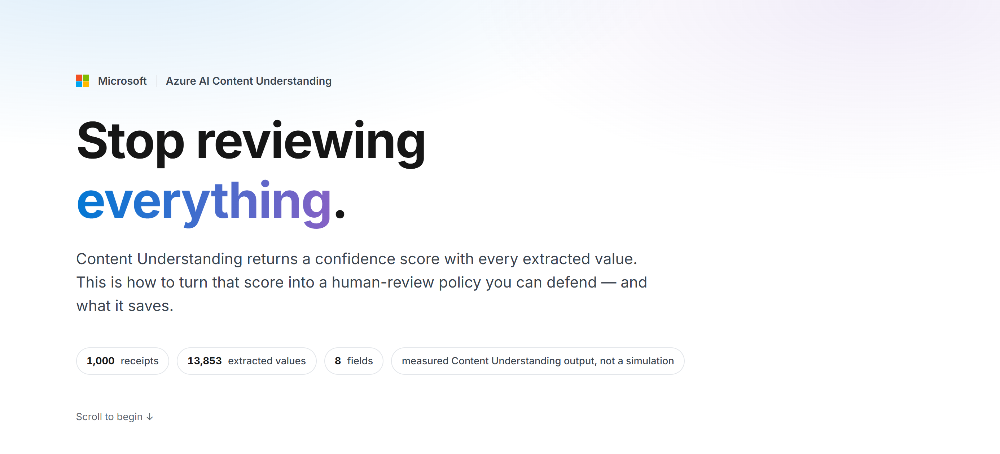
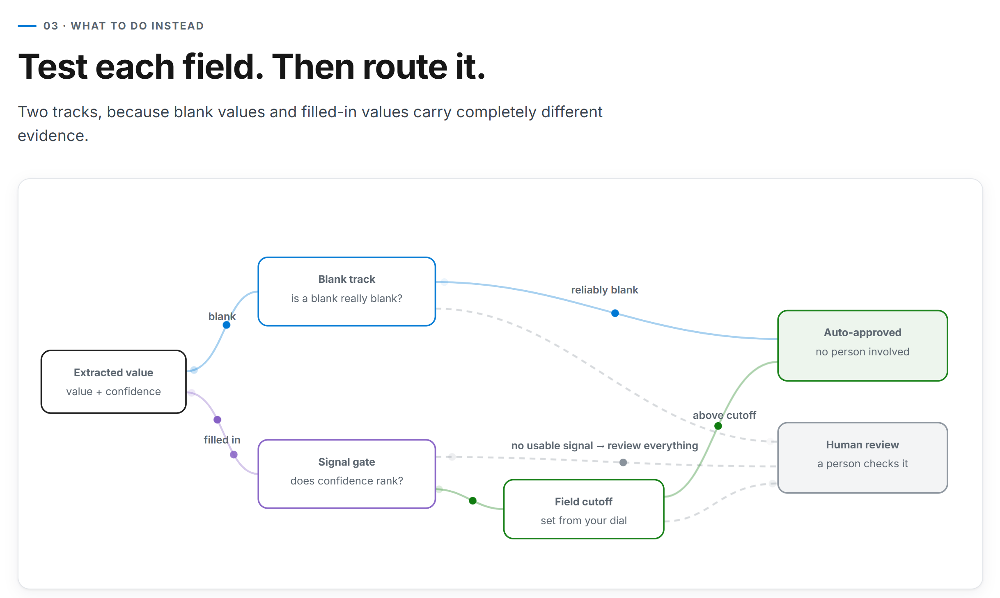
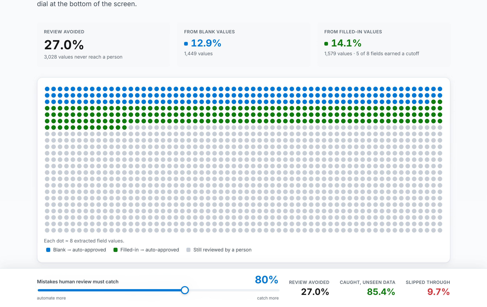
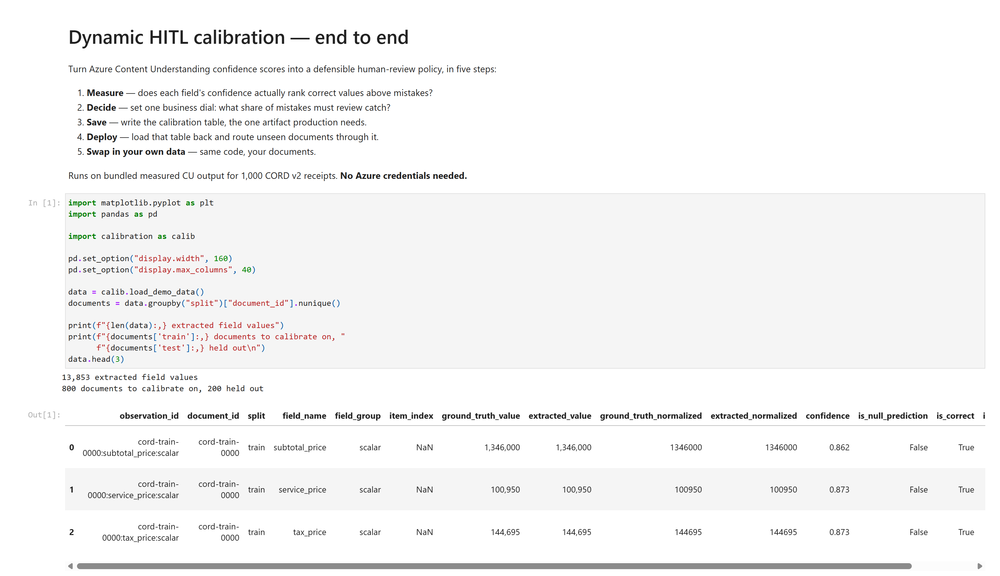

# Dynamic Human-in-the-Loop (HITL)

Azure AI Content Understanding returns a **confidence score** with every extracted value. This folder is about turning that score into a human-review policy you can defend — deciding per field which extracted values a person still has to look at — and measuring what it saves.

The method in one line: **measure each field separately, split blanks from filled-in values, and set one business dial** — the share of known mistakes that human review must catch. Everything else follows from that number.

Measured on 1,000 [CORD v2](https://huggingface.co/datasets/naver-clova-ix/cord-v2) receipts (13,853 extracted values, 8 fields), an 80% target takes **27% of values off the review queue**. Real Content Understanding output, not a simulation.

## What's in here

| Folder | What it is | Who it's for |
| --- | --- | --- |
| [`web_app/`](web_app/) | An interactive static site that explains the method and its payoff | Customers and technical stakeholders |
| [`calibration_lab/`](calibration_lab/) | The Python that does it — a notebook, the library, and the bundled dataset | Anyone running this on their own documents |

The two ship together: the site's numbers are precomputed by importing the lab's code, so the picture and the implementation can never drift apart.

---

## `web_app/` — the explainer

Six scrolling sections, from "you review everything today" to "here's what it holds up to on documents it never saw." No backend, no API keys.



The routing itself is two tracks. A blank value is judged on whether blanks from that field are reliably blank; a filled-in value has to get through a signal gate before its confidence is compared to a field-specific cutoff. Anything that fails either test falls through to a person.



Sections 4–6 are driven by one shared slider. Drag it and every chart on the page moves — the review avoided, the mistakes caught, and which fields earned a cutoff.



```powershell
cd web_app
npm install
npm run dev      # http://localhost:5173
```

---

## `calibration_lab/` — the method

A five-step notebook: measure the signal, turn the dial, save the calibration table, load that table back and route unseen documents, then swap in your own data. Runs on bundled measured CU output — **no Azure credentials needed**.



The deliverable is a single CSV — one row per field — plus two Python files. Routing at inference time is a dictionary lookup and a comparison: no model to serve, no training data in production.

```powershell
cd calibration_lab
jupyter notebook run_calibration.ipynb
```

Setup instructions are in [`calibration_lab/README.md`](calibration_lab/README.md).

---

## Where to start

- **Want the intuition?** Run the site, or read [`web_app/README.md`](web_app/README.md).
- **Want to run it on your own documents?** Go straight to [`calibration_lab/README.md`](calibration_lab/README.md) — it covers the analyzer flag that turns confidence scores on, the six columns your data needs, and how to deploy the resulting table.
