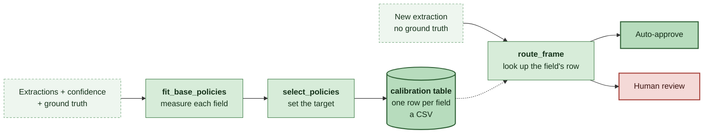
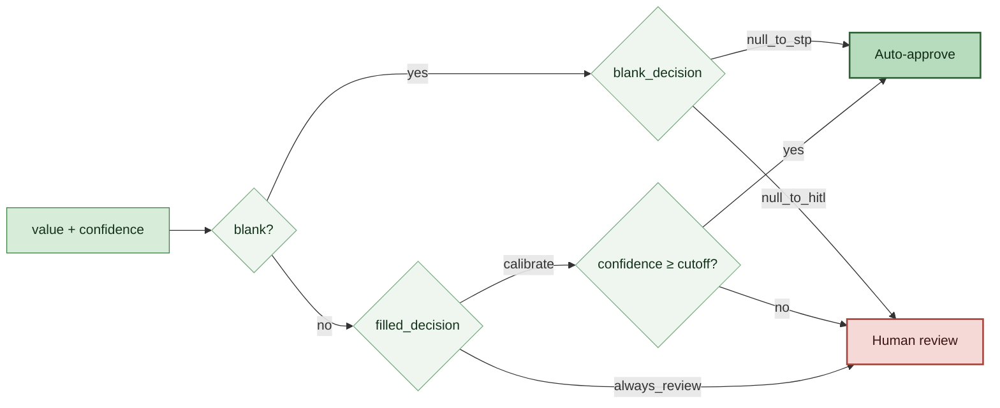

# Calibration Lab

Turn Content Understanding confidence scores into a human-review policy you can defend, then ship that policy to production as a single CSV.

The companion explainer site is in [`../web_app/`](../web_app/); it shows *what* the method does. This folder is the code that does it.

## Run it

```powershell
python -m pip install -r requirements.txt
jupyter notebook run_calibration.ipynb
```

No Azure credentials needed. `data/cord_demo.parquet` holds measured Content Understanding results for 1,000 [CORD v2](https://huggingface.co/datasets/naver-clova-ix/cord-v2) receipts, 800 to calibrate on and 200 held out.

<details>
<summary>Reproducing the dataset yourself</summary>

The bundled results were produced once, from the pinned public dataset [`naver-clova-ix/cord-v2`](https://huggingface.co/datasets/naver-clova-ix/cord-v2) (revision `7f0115a4`, CC BY 4.0) and the analyzer in [`cord_receipt_v1.json`](cord_receipt_v1.json) — 8 fields: three line-item fields plus subtotal, service, tax, other adjustment, and total.

```powershell
# 1. Download the receipts and ground truth from Hugging Face.
..\.venv\Scripts\python.exe ..\scripts\prepare_cord.py download --output ..\data\cord-v2

# 2. Create the analyzer in your CU resource and run it over the images.

# 3. Pair extractions with ground truth into the canonical frame.
..\.venv\Scripts\python.exe ..\scripts\prepare_cord.py assemble `
  --manifest ..\data\cord-v2\manifest.csv `
  --extractions ..\data\cord-v2\extractions `
  --analyzer-schema cord_receipt_v1.json `
  --output data\cord_demo.parquet
```

Step 3 fills in `is_correct` using the same rules as [`matching.py`](matching.py). Only step 2 needs Azure.

</details>

## Approach

Reviewing every extracted value is expensive; auto-approving everything above one confidence cutoff is unsafe, because a 0.9 means something different on every field. So measure each field separately, and only automate the ones that earn it.

Two tracks, because blanks and filled-in values carry different evidence:

- **Filled-in values** are ranked by confidence. A field earns a cutoff only if the lower bound of its AUC interval clears 0.5 — otherwise everything goes to review. The cutoff chosen is the one with the least review that still catches your target share of mistakes.
- **Blank values** get one on/off switch. CU returns the same placeholder confidence for every blank, so no cutoff can sort them; they are auto-approved only when a Wilson bound says they are reliably, genuinely blank.

You set one number: the share of known mistakes review must catch.

## Calibrate, then route



Calibration runs offline, once per form type. Routing runs inline on every extraction and reads nothing but the table.

```python
import calibration as lab

data = lab.load_demo_data()

# Calibrate on labeled documents, then freeze the policy at a coverage target.
base_policies = lab.fit_base_policies(data, split="train")
policies = lab.select_policies(base_policies, 0.80)

# This CSV is the deliverable.
lab.save_calibration_table(policies, "data/calibration_table_80.csv")

# Production: load the table and route. No labeled data, no model.
policies = lab.load_calibration_table("data/calibration_table_80.csv")
routed = lab.route_frame(data, policies, split="test")
per_field, totals = lab.held_out_metrics(routed)
```

## Calibration table

`save_calibration_table` writes wherever you point it — the notebook keeps its copies in [`data/`](data/). One row per field, and everything routing needs is in it:

| field_name | filled_decision | cutoff | score_mode | blank_decision | target_catch_rate | min_null_precision |
| --- | --- | --- | --- | --- | --- | --- |
| menu.name | calibrate | 0.796 | raw_confidence | null_to_hitl | 0.80 | 0.80 |
| menu.price | calibrate | 0.875 | raw_confidence | null_to_hitl | 0.80 | 0.80 |
| menu.quantity | always_review | — | raw_confidence | null_to_hitl | 0.80 | 0.80 |
| subtotal_price | calibrate | 0.856 | raw_confidence | null_to_stp | 0.80 | 0.80 |
| total_price | calibrate | 0.845 | raw_confidence | null_to_hitl | 0.80 | 0.80 |

The two targets record what the table was calibrated *to*: `target_catch_rate` is the share of mis-extractions review must catch on the filled-in track, and `min_null_precision` is the bar a field's blanks had to clear to be auto-approved. `select_policies` sets both from the one number you pass, so they usually match; they are stored separately because they are separate bars. Also carried: `lr_coef`/`lr_intercept`, `calibrated_at`, and a plain-English `why` for each decision.

**Deploying it.** Copy the CSV and two files — [`calibration.py`](calibration.py) and [`acu_calibrator.py`](acu_calibrator.py) — into your pipeline, then call `load_calibration_table` once at startup and `route_frame` per batch. Routing is a dictionary lookup and a comparison: no sklearn at inference, no training data, nothing to serve. Re-calibrating at a different target just regenerates the CSV.

To route a single value instead of a frame, the decision is:



Every routed row carries a `route_reason` — `null_policy_stp`, `raw_above_threshold`, `non_null_uncalibrated`, `missing_confidence`, `unknown_field` — so any decision can be explained later. To force a field to always be reviewed, leave it out of the table: it routes to review as `unknown_field`.

## Bring your own data

### First, make sure CU is returning confidence

Confidence scores are **opt-in**. If your analyzer does not ask for them, extractions come back without a `confidence` and there is nothing to calibrate. Set `estimateFieldSourceAndConfidence` in the analyzer config to enable them for every field:

```json
{
  "analyzerId": "my_analyzer",
  "baseAnalyzerId": "prebuilt-document",
  "config": {
    "estimateFieldSourceAndConfidence": true
  },
  "fieldSchema": { "fields": { } }
}
```

Per field, `estimateSourceAndConfidence` does the same thing and overrides the analyzer-level setting — and it is **required** for any field using `"method": "extract"`. The same flag also returns grounding (page number and bounding box), which is what lets a reviewer see where a value came from.

[`cord_receipt_v1.json`](cord_receipt_v1.json) is the analyzer behind the bundled receipts and works as a starting template.

Each field then comes back as a value plus its score, which is the pair this lab needs:

```json
{ "subtotal_price": { "value": "1,346,000", "confidence": 0.862 } }
```

### The canonical frame

One row per extracted field value:

| column | meaning |
| --- | --- |
| `document_id` | which document the value came from (keeps line items together across CV folds) |
| `split` | `train` \| `test` |
| `field_name` | which field this value belongs to |
| `extracted_value` | what CU returned, or `None` when it returned nothing |
| `confidence` | CU's confidence for that value, 0–1 |
| `is_correct` | did the value match ground truth? |

**No particular file format is required.** `load_canonical_file` reads `.csv` or `.parquet`, and every function takes a plain DataFrame — so if you already have one in memory, pass it straight in and skip files entirely:

```python
data = lab.load_canonical_file("my_data.csv")      # or .parquet
base_policies = lab.fit_base_policies(my_dataframe, split="train")
```

Two things to get right:

1. **Split by document, not by row**, so no document lands in both train and test.
2. **`is_correct` is yours to define.** The calibration never compares extractions to ground truth; it inherits whatever you put in that column. Too strict and you chase mistakes that were not mistakes; too loose and the policy certifies real ones.

[`matching.py`](matching.py) is the version this lab ships — exact match after per-field normalization — and it is what produced `is_correct` for the bundled receipts:

```python
import matching

data = matching.add_is_correct(data)
```

Normalization is not cosmetic here: it decides 2.4% of verdicts, mostly quantities where ground truth reads `1 x` and CU read `1 X`. Field rules live in `matching.FIELD_RULES` and are meant to be edited — dates, account numbers, postcodes belong there. Already have an evaluation harness? Use it instead and skip this module.

### How much labeled data

A field earns a cutoff once its interval clears the bar, which takes more than the bare minimums the code enforces. On the CORD receipts, per field: roughly **150+ filled-in values**, and **15–30 blanks** for the blank track, which tightens much faster. Below ~100 documents nothing qualified at all.

Fields that do not qualify route to full review — the behaviour you had before calibrating — so thin data costs savings, never safety. Re-fit as labels accumulate.

## The modules

| File | What it is |
| --- | --- |
| [`run_calibration.ipynb`](run_calibration.ipynb) | The whole method end to end: measure → set the dial → save the table → reload it and route unseen documents. |
| [`calibration.py`](calibration.py) | The API you call. |
| [`matching.py`](matching.py) | Produces `is_correct` from extractions and ground truth. |
| [`cord_receipt_v1.json`](cord_receipt_v1.json) | The CU analyzer used for the bundled receipts, with confidence scores enabled. |
| [`acu_calibrator.py`](acu_calibrator.py) | The engine: grouped cross-validation, AUC intervals, Wilson bounds, threshold sweeps. Reached through `calibration.py`. |

`calibration.py`, in the order you use it:

| Function | What it does |
| --- | --- |
| `load_demo_data()` / `load_canonical_file(path)` | Read the bundled receipts, or your own `.csv`/`.parquet`. Any function will also take a DataFrame directly. |
| `fit_base_policies(frame, split="train")` | The expensive call. Per field: grouped CV, a bootstrap interval on AUC, a Wilson interval on blank precision, and a sweep of every candidate cutoff — all cached, so re-deciding at another target is nearly free. |
| `signal_frame(base_policies)` | Per-field signal summary. The "is this worth calibrating?" table. |
| `select_policies(base_policies, target)` | Pick every cutoff from one number. Pass a `{field: target}` mapping to vary it per field. |
| `calibration_table(policies)` / `save_calibration_table(...)` / `load_calibration_table(path)` | Build, write, and reload the deployment artifact. |
| `route_frame(frame, policies, split="test")` | Route rows through a frozen policy, exactly as production would. |
| `held_out_metrics(routed)` | What actually happened: auto-approve rate, catch rate, mistakes that slipped through. |
| `savings_attribution` / `savings_sweep` | Expected savings, split by track, at one target or across the range. |
| `coverage_tracking` / `naive_threshold_sweep` | Does the dial behave like a dial, and how a single global cutoff compares. |

### Why a field might not get a cutoff

Gates are floors for running the estimator at all; the interval does the real work, staying wide and failing on its own when a field is sparse.

| Gate | Value | Reason |
| --- | --- | --- |
| `min_samples` | 20 filled-in rows | Don't fit on almost nothing. |
| `min_errors_for_cv` | 5 mistakes | 5-fold CV needs a minority-class row per fold. |
| distinct documents | 5 | Grouped CV needs at least `n_splits` groups. |
| `min_auc_ci_lower` | 0.50 | The whole AUC interval must beat a coin flip. |
| `min_nulls` | 10 blanks | A Wilson bound on fewer blanks clears no sensible bar. |

Filled-in decisions are `calibrate`, `always_trust`, `always_review`, or `insufficient_data`; blank decisions are `null_to_stp`, `null_to_hitl`, `insufficient_nulls`, or `no_nulls_observed`. Anything that fails a gate falls back to review.

## Adding predictors later

`fit_base_policies` defaults to `score_mode="raw_confidence"`, thresholding confidence directly. `score_mode="logistic"` first fits a one-dimensional logistic regression mapping confidence to `P(correct)`, and thresholds that instead.

Both modes ship in the same table and route through the same code. What changes is how three columns are read:

| | `raw_confidence` | `logistic` |
| --- | --- | --- |
| `lr_coef`, `lr_intercept` | empty | the fitted curve |
| `cutoff` | a raw confidence | a `P(correct)` probability |
| routing test | `confidence >= cutoff` | `sigmoid(lr_coef * confidence + lr_intercept) >= cutoff` |

With confidence as the only predictor the two are monotone transforms of one another, so they rank values identically and produce the same routing — the same boundary in different units. On the bundled receipts, `menu.name` gets a raw cutoff of `0.796` and a logistic cutoff of `0.7698`, and `sigmoid(2.077 × 0.796 − 0.446) = 0.7698` exactly. Both auto-approve 27.6% of held-out values and catch 86.6% of the mistakes.

So switching modes today buys nothing, which is the point: it is a slot, not an upgrade. The logistic form is what you extend when you gain a *second* predictor of correctness — page quality, vendor, field length, a cross-field consistency check — at which point the score stops being a function of confidence alone and the fitted coefficients start doing real work.
